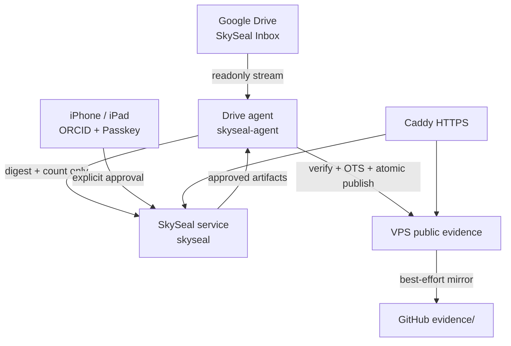

# SkySeal 本番運用仕様書・保守手引き

- 更新日: 2026-08-30
- 対象: SkySeal v1.1 本番環境
- 本番URL: <https://proof.excyberlab.net/>
- 公開証拠一覧: <https://proof.excyberlab.net/proofs/>

この文書は、しばらく運用から離れた後でも、現在の構成、データの流れ、秘密情報の境界、
更新方法、障害時の確認順を短時間で復元するための主運用文書である。プロトコルの厳密な
バイト仕様は [`../spec/v1.md`](../spec/v1.md)、初期構築の詳細は
[`../deploy/README.ja.md`](../deploy/README.ja.md) を参照する。

この文書に秘密値は記載しない。DriveフォルダID、秘密鍵、トークン、ORCID client secretを
Git、チャット、Issue、画面共有へ貼らないこと。

## 1. 5分で思い出すための要約

### 現在の構成

| 項目 | 現在値 |
|---|---|
| ソースコード | `github.com/kagaya/SkySeal`, `main` |
| 公開サービス | `https://proof.excyberlab.net` |
| VPS | さくらのVPS、`133.242.139.27` |
| VPS管理ユーザー | `ubuntu`、公開鍵SSH、必要時のみ`sudo` |
| Webサービス | `skyseal.service`、Linuxユーザー`skyseal` |
| Driveエージェント | `skyseal-drive-agent.service`とtimer、Linuxユーザー`skyseal-agent` |
| OTS更新 | `skyseal-ots-upgrade.service`とtimer |
| Web公開 | Caddy、80/443、Pythonは`127.0.0.1:8787`だけ |
| 本人性 | ORCID `0000-0003-3001-7690` + iPhone Passkey |
| 原ファイル正本 | Google Driveの専用`SkySeal Inbox` |
| 公開証拠正本 | VPS `/var/lib/skyseal-public`、GitHubはミラー |
| 定常更新 | VPSで`sudo skyseal-update` |

### 通常行うことは二つだけ

1. 原ファイルをGoogle Driveの`SkySeal Inbox`直下へ置き、約120秒変更せず待つ。iPhoneで
   <https://proof.excyberlab.net/> を開き、対象Seal IDとハッシュ件数を確認してPasskey承認する。
2. ソフトウェア更新後は、任意の管理端末から次を実行する。

```bash
ssh -t skyseal-proof 'sudo skyseal-update'
```

成功時の末尾は次の形になる。

```text
[skyseal-update] Update completed at commit <12桁commit>
Public evidence: https://proof.excyberlab.net/proofs/
```

更新直後に`curl: (7) Failed to connect to 127.0.0.1 port 8787`が一度出ても、後続の再試行が
成功して上記完了行まで出れば障害ではない。完了行が出なければ失敗として扱う。

### 最初に見る場所

```bash
ssh skyseal-proof
sudo systemctl status skyseal.service --no-pager
sudo systemctl list-timers skyseal-drive-agent.timer skyseal-ots-upgrade.timer --no-pager
sudo journalctl -u skyseal-drive-agent.service -n 50 --no-pager
```

Webからは次を確認する。

- 承認画面: <https://proof.excyberlab.net/>
- VPS上の公開証拠: <https://proof.excyberlab.net/proofs/>
- 公開APIの生存確認: <https://proof.excyberlab.net/api/v1/me>

`/api/v1/me`が未ログイン時に`{"authenticated":false,...}`を返すのは正常である。

## 2. 何を実現しているシステムか

SkySealは、Google Drive上の原ファイルを公開せず、そのSHA-256ハッシュ集合に対して、
ORCIDで特定した本人がPasskeyで承認した証拠を作る。証拠にはOpenTimestampsを付け、VPSへ
先に保存し、その後GitHubへ同じ内容をミラーする。

公開証拠が主張するのは次の内容である。

- あるバイト列集合のSHA-256ハッシュ集合が存在した。
- ORCIDに結び付いたPasskeyのUser PresentとUser Verifiedを伴う署名で承認された。
- `.ots`を検証できる時点では、その対象証拠がブロックチェーン時刻より前に存在した。

次の内容は主張しない。

- 公開ハッシュとファイル名、Drive ID、フォルダ構造の対応。
- ORCID以外の実世界の属性や研究内容の正しさ。
- `created_at`が第三者により保証された厳密な作成時刻であること。
- 原ファイルを持たない第三者が、その内容を復元できること。

公開ハッシュは既知候補照合を防がない。同じ候補ファイルを持つ人はSHA-256を計算し、集合に
含まれるか確認できる。

## 3. 全体構成



### 信頼境界

| 境界 | 読めるもの | 読めない・保持しないもの |
|---|---|---|
| Google Drive | 原ファイル、名前、構造 | SkySealのPasskey秘密鍵 |
| `skyseal-agent` | 専用Inbox、Drive ID、原バイトのストリーム、非公開ジョブ情報 | Passkey秘密鍵 |
| `skyseal` | ORCID、Passkey公開鍵、承認トランザクション、公開証拠 | Googleサービスアカウント鍵、Drive名・ID |
| iPhone/iPad | Passkey、承認操作 | Drive/GitHubの長期トークン |
| VPS公開領域/GitHub | ハッシュ、署名、本人登録証明、OTS証明 | 原ファイル、名前、パス、Drive ID、対応表 |

同一VPS上でLinuxユーザーとディレクトリを分離しているが、VPSのroot権限またはホスト自体が
侵害されれば、専用Inboxの内容を読まれる可能性は残る。これは同一VPS構成の明示的な限界である。

## 4. 原ファイルから公開までの動作

### 4.1 Drive上の処理単位

`SkySeal Inbox`の**直下の各項目が一つのseal単位**になる。

| Drive直下の置き方 | 作られるseal |
|---|---|
| ファイルを3個、別々に置く | 原則3個のseal、3回の承認 |
| フォルダを1個置き、その中に3個入れる | フォルダ全体で1個のseal、1回の承認 |
| フォルダ2個を置く | 2個のseal |

フォルダは再帰的に走査される。空フォルダは送信されず、ショートカットは禁止される。
一つのsealのハッシュ一覧はソート・重複除去された数学的集合なので、公開証拠から順序、階層、
同一内容の重複個数は分からない。

### 4.2 監視から承認まで

1. 1分timerがDriveエージェントを起動する。
2. 専用Inbox直下を読み、名前を要求しないDrive API field maskで非公開スナップショットを作る。
3. スナップショットが120秒変化しなければハッシュを計算する。
4. 計算後にDriveを再観測し、途中変更があれば破棄して安定待ちへ戻す。
5. `skyseal-sha256-set-v1`形式のハッシュ一覧はagent内に保持し、その一覧自体のダイジェストと
   件数だけを公開サービスへ送り、15分有効の承認トランザクションを作る。
6. ORCIDログイン済みPWAには、Seal ID、時刻、ハッシュ件数、状態だけを表示する。
7. 利用者が対象を選び、iPhone/iPadのPasskeyで明示的に承認する。

承認画面には原ファイル、ファイル名、Drive上のパスを送らない。このため、複数候補がある場合は
Seal ID、到着時刻、ハッシュ件数で選ぶ。

### 4.3 ハッシュ時の原ファイル

通常ファイルはDriveから1 MiBずつ読み、逐次SHA-256へ投入する。アプリケーションは原ファイルを
VPSディスクへ書き出さず、ファイル全体を一度にRAMへ載せない。Google Driveが
`sha256Checksum`を返す通常ファイルでは、計算値との一致も要求する。

大きな通常ファイルもメモリ使用量はファイルサイズに比例しないが、DriveからVPSへ全バイトを
転送する時間と帯域は必要である。Google Docs/Sheets/Slides/DrawingsはそれぞれPDF、XLSX、
PDF、PDFへexportした**そのバイト列**をハッシュする。Driveの通常`files.export`には10 MB制限が
あるため、大きなGoogle Workspace文書は通常ファイルとして保存してから処理する。

原バイトはプロセスのメモリを通る。エージェントunitには`MemorySwapMax=0`と`LimitCORE=0`を
設定し、このサービスのswapとcore dumpを禁止している。ただしOS、root、仮想化ホストの侵害まで
防ぐものではない。

### 4.4 承認後

1. エージェントが承認済みbundle、identity genesis、identity activationを取得する。
2. trusted RP ID `proof.excyberlab.net`とtrusted origin
   `https://proof.excyberlab.net`をローカル設定から与え、署名、User Present、User Verified、
   ORCID本人登録との結合を独立検証する。
3. `seal.skyseal.json`と`identity-activation.json`をOpenTimestampsへstampする。
4. 完全な証拠一式をVPS公開領域へ原子的に保存する。
5. GitHubへ順次ミラーし、完全性を示す`manifest.json`を最後に送る。
6. 毎日のOTS upgradeでBitcoin確認を取り込み、`.ots`とmanifestだけを更新する。

GitHubが失敗してもVPS公開は取り消さない。ジョブの`github_status`を`pending`にして次回の
エージェント実行時に再試行する。したがってGitHub障害中も`/proofs/`から証拠を取得できる。

## 5. 保存されるデータ

| 場所 | 主な内容 | 権限・公開性 |
|---|---|---|
| Google Drive `SkySeal Inbox` | 原ファイル、名前、フォルダ | Google Driveの共有設定 |
| `/var/lib/skyseal/skyseal.sqlite3` | ORCID、セッション、Passkeyルーティング情報、公開鍵、承認トランザクション、agent tokenのハッシュ | `skyseal:skyseal`, 600 |
| `/var/lib/skyseal-agent/drive-agent.sqlite3` | Drive ID、snapshot、hash list、private bearer、成果物、GitHub同期状態 | `skyseal-agent:skyseal-agent`, 600 |
| `/var/lib/skyseal-agent/work` | OTS・検証用の短命な作業ファイル | 非公開、処理後削除 |
| `/var/lib/skyseal-public/index.json` | 公開証拠一覧とGitHub同期状態 | 公開 |
| `/var/lib/skyseal-public/evidence/YYYY/MM/<seal-id>/` | 完全な公開証拠 | 公開、dirs 755/files 644 |
| GitHub `evidence/YYYY/MM/<seal-id>/` | VPS公開証拠と同じ内容のミラー | 公開 |
| `/var/lib/skyseal/backups/` | 更新前のservice SQLite online backup | 非公開、600 |
| `/var/lib/skyseal-agent/backups/` | 更新前のagent SQLite online backup | 非公開、600 |

SQLiteはWAL modeなので、稼働中は`-wal`と`-shm`が見えることがある。ファイルがないように見えた
場合は、root globではなく次のように確認する。

```bash
sudo sh -c 'ls -l /var/lib/skyseal/skyseal.sqlite3*'
```

### 公開される7ファイル

```text
evidence/YYYY/MM/<seal-id>/
  hashes.txt
  seal.skyseal.json
  seal.skyseal.json.ots
  identity-genesis.json
  identity-activation.json
  identity-activation.json.ots
  manifest.json
```

`manifest.json`は他の6ファイルのSHA-256と、どの`.ots`がどの対象をstampしたかを記録する。
検証時は一覧ページではなくmanifest、署名、trusted RP/origin、OTSを検査する。

## 6. 本番ホストの構成台帳

### 固定識別子

固定値の機械可読な正本は[`../deploy/production-profile.json`](../deploy/production-profile.json)である。

| 設定 | 値 |
|---|---|
| root domain | `excyberlab.net` |
| service origin | `https://proof.excyberlab.net` |
| WebAuthn RP ID | `proof.excyberlab.net` |
| ORCID callback | `https://proof.excyberlab.net/api/v1/orcid/callback` |

originまたはRP IDを変えると既存Passkeyをそのまま使えない。DNS名変更は通常更新ではなく、本人登録の
移行を伴う設計変更として扱う。

### ファイルとサービス

| 役割 | リポジトリ内 | VPS上 |
|---|---|---|
| 本番checkout | GitHub `main` | `/opt/skyseal`、root所有 |
| Web設定 | `service/env.example`を雛形 | `/etc/skyseal/service.env` |
| Agent設定 | `drive_agent/env.example`を雛形 | `/etc/skyseal-agent/agent.env` |
| Google鍵 | リポジトリへ入れない | `/etc/skyseal-agent/google-service-account.json` |
| GitHub token | リポジトリへ入れない | `/etc/skyseal-agent/github.token` |
| Drive agent token | リポジトリへ入れない | `/etc/skyseal-agent/drive-agent.token` |
| Web unit | `deploy/skyseal.service` | `/etc/systemd/system/skyseal.service` |
| Agent units | `deploy/skyseal-drive-agent.*` | `/etc/systemd/system/` |
| OTS units | `deploy/skyseal-ots-upgrade.*` | `/etc/systemd/system/` |
| Caddy設定 | `deploy/Caddyfile.example` | `/etc/caddy/Caddyfile` |
| 更新プログラム | `deploy/skyseal-update` | `/usr/local/sbin/skyseal-update` |
| Caddy管理hash | 自動生成 | `/etc/caddy/.skyseal-managed.sha256` |
| Caddy更新backup | 自動生成 | `/etc/caddy/skyseal-backups/` |

`/opt/skyseal`はroot所有なので、`ubuntu`で通常の`git status`をするとdubious ownershipになる。
`safe.directory`を広げず、VPS上のGit操作は`sudo git -C /opt/skyseal ...`または
`sudo skyseal-update`で行う。

### systemdの性質

| Unit | Type/周期 | 正常状態 |
|---|---|---|
| `skyseal.service` | 常駐 | `active (running)` |
| `skyseal-drive-agent.timer` | 前回終了から約1分 | `active (waiting)` |
| `skyseal-drive-agent.service` | `oneshot` | 実行後`inactive (dead)`, `Result=success` |
| `skyseal-ots-upgrade.timer` | 毎日04:10 UTC + jitter | `active (waiting)` |
| `skyseal-ots-upgrade.service` | `oneshot` | 実行後`inactive (dead)`, `Result=success` |
| `caddy` | 常駐 | `active (running)` |

oneshotが`inactive (dead)`なのは停止ではなく正常終了である。`Result=success`、
`ExecMainStatus=0`を併せて確認する。

## 7. 2026-08-30に行った初期構築

後から「なぜこの状態なのか」を復元できるよう、実施内容を順に記録する。

1. `proof.excyberlab.net`をVPSへ向け、CaddyでHTTPSを終端した。外部着信はSSH、80、443だけ、
   Python 8787はloopbackだけにした。ORCID callbackに認可codeが含まれるためCaddy access logは
   有効化していない。
2. `/opt/skyseal`へGitHub `main`を配置し、`skyseal`専用ユーザー、mode 700の設定・状態領域、
   Python venv、`skyseal.service`を作った。
3. ORCID OAuthで`0000-0003-3001-7690`を認証し、iPhone Passkeyを登録、二度目の
   User-Verified assertionでidentityを`active`にした。現在の本番seal承認にOpenPGPは必須でない。
4. Drive API専用Google service accountを作り、Domain-wide delegationを使わず、
   `SkySeal Inbox`だけをViewer共有した。外部鍵作成を禁止する組織ポリシーは、鍵作成時だけ
   プロジェクトで明示的に例外設定し、JSON取得後に再び禁止状態へ戻した。作業のため一時付与した
   組織ポリシー管理権限も削除した。
5. `kagaya/SkySeal`だけに限定し`Contents: write`だけを持つfine-grained PAT
   `SkySeal Drive Agent`を作った。これはagentのGitHubミラー専用である。
6. active identityからランダムなDrive agent tokenを一度生成し、Google鍵、PAT、folder IDと共に
   VPSへmode 600で配置した。転送用stagingと一時exportは確認後に削除した。
7. `skyseal-agent`専用ユーザー、別venv、private SQLite、1分timer、毎日のOTS timerを設定した。
8. OTS clientがhome `/nonexistent`へcacheを作ろうとして失敗したため、unitに
   `XDG_CACHE_HOME=/var/lib/skyseal-agent/cache`を固定した。
9. iPhone PWAの古いservice worker/cacheと承認対象引継ぎを修正し、静的assetを`no-cache`で
   再検証するようにした。
10. agent unitへ`LimitCORE=0`と`MemorySwapMax=0`を追加した。
11. GitHubより先にVPSへ証拠を原子的保存する方式へ変更し、`/proofs/`と`/evidence/`を公開した。
12. DB backup、依存更新、unit検証、Caddy差分保護、サービス再起動、全endpoint確認を行う
    `sudo skyseal-update`へ定常更新を集約した。

最初の本番証拠はSeal ID `01a05049-3b96-78fa-98ed-065299fb491e`で、VPS保存とGitHub同期を
確認済みである。

## 8. 新しい管理端末を準備する

本番の更新実行だけなら、Git checkoutもGitHub tokenも不要で、VPSへSSHできればよい。
ソース変更、patch適用、pushも行う端末にはGitとGitHub用SSH鍵を追加する。

### 8.1 共通方針

1. 端末ごとに新しいVPS用Ed25519鍵を作る。古いMacの秘密鍵をコピーするより、公開鍵を追加する。
2. 既に接続できる端末から、新端末の**公開鍵だけ**を
   `/home/ubuntu/.ssh/authorized_keys`へ追加する。
3. 既存接続を閉じる前に、新端末から二つ目のSSH接続が成功することを確認する。
4. GitHub用鍵はVPS用鍵と分け、GitHubアカウントへ公開鍵だけ登録する。
5. `/etc/skyseal-agent/github.token`、Google JSON、Drive agent tokenを管理端末へコピーしない。

VPSのhost key fingerprintは、既に信頼した接続から次で確認し、新端末の初回接続表示と比較する。

```bash
sudo ssh-keygen -lf /etc/ssh/ssh_host_ed25519_key.pub
```

### 8.2 macOS

現在のiMacでは既存鍵`~/.ssh/skyseal_vps_imac_v2`が使える。別Macでは新しい鍵を作る。

```bash
mkdir -p ~/.ssh
chmod 700 ~/.ssh
ssh-keygen -t ed25519 -a 100 -f ~/.ssh/skyseal_vps_macbook
chmod 600 ~/.ssh/skyseal_vps_macbook
```

`~/.ssh/config`へ追加する。

```sshconfig
Host skyseal-proof
    HostName 133.242.139.27
    User ubuntu
    IdentityFile ~/.ssh/skyseal_vps_macbook
    IdentitiesOnly yes
    ServerAliveInterval 30
    ServerAliveCountMax 3
```

既存iMacの設定では`IdentityFile`を`~/.ssh/skyseal_vps_imac_v2`にする。確認する。

```bash
chmod 600 ~/.ssh/config
ssh skyseal-proof
ssh -t skyseal-proof 'sudo skyseal-update'
```

SSH aliasをまだ作っていない現在のiMacからは、従来どおり次でも同じ更新を実行できる。

```bash
ssh -t -o IdentitiesOnly=yes -i ~/.ssh/skyseal_vps_imac_v2 \
  ubuntu@133.242.139.27 'sudo skyseal-update'
```

### 8.3 Linux

Ubuntu/Debian系の例である。

```bash
sudo apt-get update
sudo apt-get install -y openssh-client git
mkdir -p ~/.ssh
chmod 700 ~/.ssh
ssh-keygen -t ed25519 -a 100 -f ~/.ssh/skyseal_vps_linux
chmod 600 ~/.ssh/skyseal_vps_linux
```

`~/.ssh/config`はmacOSと同じで、`IdentityFile`だけ
`~/.ssh/skyseal_vps_linux`にする。その後`ssh skyseal-proof`で確認する。

### 8.4 Windows PowerShell

Windows 10/11のOpenSSH ClientとGit for Windowsを使う。最初に確認する。

```powershell
ssh -V
git --version
```

OpenSSH Clientがない場合はWindowsの「オプション機能」から追加する。鍵を作る。

```powershell
$SshDir = Join-Path $env:USERPROFILE ".ssh"
New-Item -ItemType Directory -Force $SshDir | Out-Null
$VpsKey = Join-Path $SshDir "skyseal_vps_windows"
ssh-keygen -t ed25519 -a 100 -f $VpsKey
icacls.exe $VpsKey /inheritance:r /grant:r "$($env:USERNAME):(R)"
```

`$env:USERPROFILE\.ssh\config`へ次を保存する。

```sshconfig
Host skyseal-proof
    HostName 133.242.139.27
    User ubuntu
    IdentityFile ~/.ssh/skyseal_vps_windows
    IdentitiesOnly yes
    ServerAliveInterval 30
    ServerAliveCountMax 3
```

PowerShellから確認・更新する。

```powershell
ssh skyseal-proof
ssh -t skyseal-proof "sudo skyseal-update"
```

### 8.5 Windows WSL

WSLを使う場合はLinux手順に統一する。秘密鍵は`/mnt/c/...`から直接使わず、WSL内の
`~/.ssh`へ置いてmode 600にする。端末ごとに新しく作るのが望ましい。

```bash
mkdir -p ~/.ssh
chmod 700 ~/.ssh
ssh-keygen -t ed25519 -a 100 -f ~/.ssh/skyseal_vps_wsl
chmod 600 ~/.ssh/skyseal_vps_wsl
```

### 8.6 新しい公開鍵をVPSへ追加する

新端末で`.pub`の一行を表示し、公開鍵だけを既存の信頼済み端末へ渡す。

```bash
cat ~/.ssh/skyseal_vps_linux.pub
```

既存端末から、その一行を末尾へ追加する。以下の`ssh-ed25519 ...`は実際の公開鍵一行へ
置き換える。秘密鍵は絶対に貼らない。

```bash
printf '%s\n' 'ssh-ed25519 AAAA... new-maintenance-host' | \
  ssh skyseal-proof 'umask 077; mkdir -p ~/.ssh; cat >> ~/.ssh/authorized_keys'
```

新端末から接続できたことを確認してから作業完了とする。古い鍵を削除する場合も、別接続を
維持し、削除後の再接続を確認してから既存接続を閉じる。

## 9. GitHubへ変更を出す端末の設定

GitHubミラー用PATを流用しない。保守担当者のGitHub SSH鍵を端末ごとに作り、GitHubの
「SSH and GPG keys」へ公開鍵を登録する。

```bash
ssh-keygen -t ed25519 -a 100 -f ~/.ssh/skyseal_github_maintenance
chmod 600 ~/.ssh/skyseal_github_maintenance
```

`~/.ssh/config`へ追加する。

```sshconfig
Host github.com
    HostName github.com
    User git
    IdentityFile ~/.ssh/skyseal_github_maintenance
    IdentitiesOnly yes
```

確認してcloneする。

```bash
ssh -T git@github.com
git clone git@github.com:kagaya/SkySeal.git
cd SkySeal
git switch main
git pull --ff-only origin main
```

Windows PowerShellでも同じ`ssh-keygen`、SSH config、`git clone`を使える。鍵ファイルには
前節と同じ`icacls`制限を適用する。

## 10. 標準の更新手順

### 10.1 コード変更またはpatch適用

作業cloneで必ず最新`main`から始める。

```bash
git switch main
git pull --ff-only origin main
git status --short
```

Codex Work等から受け取ったmail-formatted patchは次で適用する。

```bash
git am ~/Downloads/0001-description.patch
git status --short
git log -1 --oneline
```

競合時に`git am --abort`を実行すると、そのpatch適用開始前へ戻る。未確認の状態で
`git reset --hard`やforce pushを使わない。

コード変更時の基本試験は次である。

```bash
python3 -m unittest discover -s verifier/tests -v
python3 -m unittest discover -s service/tests -v
python3 -m unittest discover -s drive_agent/tests -v
git diff --check
```

試験後にpushする。

```bash
git push origin main
```

pushが`fetch first`で拒否された場合は、他の更新を取り込んで自分のcommitを上へ載せ直す。

```bash
git pull --rebase origin main
git push origin main
```

競合が出た場合は機械的に選ばず内容を確認する。

### 10.2 本番へ反映

管理端末のOSにかかわらず同じ一コマンドである。

```bash
ssh -t skyseal-proof 'sudo skyseal-update'
```

`skyseal-update`は次をfail-closedで行う。

1. `/opt/skyseal`に追跡対象の手修正がないことと`main`であることを確認する。
2. `origin/main`を`--ff-only`で取得する。
3. 二つのtimerを止め、agent lockを最大120秒待つ。
4. service DBとagent DBをSQLite online backup APIでcommit単位に保存する。
5. service/agentの別々のvenvへ依存関係を更新する。
6. systemd unitを配置し、`systemd-analyze verify`する。
7. 既存の全公開証拠をVPS公開領域へ再確認・localizeする。
8. `skyseal.service`を再起動し、loopback endpointをretry付きで確認する。
9. Caddy候補をvalidateし、管理hashと現在値が一致する場合だけ更新する。手修正は上書きしない。
10. updater自身を`/usr/local/sbin`へ更新する。
11. timerを再開し、agentを一度実行する。
12. HTTPS endpointと常駐unit/timerを**一つずつ**確認する。

途中失敗時はcleanupでtimer再開を試みるが、完了行がなければログとunit状態を確認する。

### 10.3 反映後の確認

```bash
ssh -t skyseal-proof 'sudo git -C /opt/skyseal rev-parse --short=12 HEAD'
curl -fsS https://proof.excyberlab.net/proofs/ >/dev/null && echo OK
```

公開証拠のあるSeal IDを一つ開き、7ファイルへのリンクとGitHub同期状態も確認する。

## 11. 定期点検

### 毎回の更新後

```bash
sudo systemctl is-active skyseal.service
sudo systemctl is-active caddy
sudo systemctl is-active skyseal-drive-agent.timer
sudo systemctl is-active skyseal-ots-upgrade.timer
sudo systemctl show skyseal-drive-agent.service \
  -p ActiveState -p SubState -p Result -p ExecMainStatus -p MemorySwapMax -p LimitCORE \
  --no-pager
```

期待値は、常駐二つとtimer二つが`active`、agent oneshotが`Result=success`、
`ExecMainStatus=0`、`MemorySwapMax=0`、`LimitCORE=0`である。

### 月1回

```bash
sudo systemctl --failed --no-pager
sudo journalctl -u skyseal.service -u skyseal-drive-agent.service \
  -u skyseal-ots-upgrade.service --since '30 days ago' -p warning --no-pager
sudo du -sh /var/lib/skyseal /var/lib/skyseal-agent /var/lib/skyseal-public
sudo find /var/lib/skyseal/backups /var/lib/skyseal-agent/backups \
  -maxdepth 1 -type f -printf '%TY-%Tm-%Td %10s %p\n' | sort
```

backupの自動世代削除はしない。容量を確認し、削除が必要なら復旧点と保持方針を決めてから行う。

### GitHub同期状態

```bash
sudo -u skyseal-agent /opt/skyseal/.venv-agent/bin/python -c \
  'import sqlite3; db=sqlite3.connect("/var/lib/skyseal-agent/drive-agent.sqlite3"); print(*db.execute("SELECT seal_id,status,github_status,COALESCE(github_error,\"\") FROM jobs ORDER BY created_at DESC LIMIT 20").fetchall(), sep="\n")'
```

`published, pending`はVPS公開済み・GitHub再試行中を意味する。次のagent passで再試行される。

### 本人登録とagent token

秘密値を表示せず、現在状態だけ確認する。

```bash
sudo -u skyseal /opt/skyseal/.venv/bin/python -c \
  'import sqlite3; db=sqlite3.connect("/var/lib/skyseal/skyseal.sqlite3"); print(db.execute("SELECT orcid,status,activation_method,activation_digest FROM identities").fetchall()); print("active agent tokens:", db.execute("SELECT COUNT(*) FROM agent_tokens WHERE status=\"active\"").fetchone()[0])'
```

## 12. 障害時の確認表

| 症状 | 意味・確認 | 対応 |
|---|---|---|
| `502`または`curl (7)`が再起動直後に一度出る | Python起動よりCaddy/確認が先行 | updaterが完了行まで進めば正常。停止したら`skyseal.service`ログを見る |
| agentが`inactive (dead)` | oneshot実行後の通常状態の可能性 | `Result=success`, `ExecMainStatus=0`を確認 |
| `OpenTimestamps operation failed` | OTS network/cache/calendar問題 | `XDG_CACHE_HOME`、DNS、時刻、journalを確認。承認済みjobは再実行可能 |
| `/nonexistent/.cache/ots` PermissionError | 古いunitまたは環境 | 最新unitの`XDG_CACHE_HOME=/var/lib/skyseal-agent/cache`を確認し`sudo skyseal-update` |
| PWAに「承認トランザクションがありません」 | 古いPWA cache、期限切れ、対象選択消失 | Safariで再読込、最新asset確認、15分以内の新しいpendingを選択 |
| GitHubだけ見えない | mirror失敗 | `/proofs/`でVPS証拠を確認。`github_status`とjournalを見る。自動再試行 |
| `dubious ownership` | `/opt/skyseal`はroot所有 | `sudo git -C /opt/skyseal ...`か`sudo skyseal-update`を使う |
| `fetch first`でpush拒否 | remoteが先行 | 作業cloneで`git pull --rebase origin main`、確認後push |
| Caddyfile local changesでupdater停止 | 管理hashと`/etc/caddy/Caddyfile`が不一致 | `sudo diff -u /etc/caddy/Caddyfile /opt/skyseal/deploy/Caddyfile.example`で意図を確認。勝手にmarkerを書き換えない |
| Drive項目が出ない | share、folder ID、安定待ち、未対応形式 | service accountが専用InboxのViewerか、120秒無変更か、journalを確認 |
| 大きいGoogle文書でexport失敗 | Drive export制限 | PDF/XLSX等の通常ファイルへ保存してInboxへ置く |
| updateがagent lockで停止 | 大容量hash/OTS処理中 | agent journalを確認。処理が安全に終わってから再実行 |

ログには秘密値を出さない設計だが、共有前にはtoken、OAuth code、Drive ID、folder IDが混入して
いないか確認する。

## 13. バックアップと復旧

### 自動backup

更新ごとに、対象commitを名前に含むonline backupを作る。同じcommitのbackupが既にある場合は
上書きしない。

```text
/var/lib/skyseal/backups/skyseal.sqlite3.before-<commit>
/var/lib/skyseal-agent/backups/drive-agent.sqlite3.before-<commit>
```

公開証拠はVPSとGitHubに二重化されるが、GitHubはミラーであり、VPSの`index.json`とagent DBには
GitHubにない運用状態がある。原ファイルの正本と世代管理はGoogle Drive側で別途行う。

### DB復旧の原則

復旧は通常更新ではない。次の順を守る。

1. 失敗したcommit、journal、現在DB、選ぶbackupを記録する。
2. 対象serviceとtimerを止める。
3. 現在DBを削除せず、別名で退避する。
4. backupを正しい所有者・mode 600で戻す。
5. `check_config.py`、service起動、公開endpointを確認する。
6. agent DB復旧時はDrive agent lockを取り、serviceとtimerが停止中であることを確認する。

具体的なbackup名を確定しないままcopy、`rm`、globを実行しない。SQLiteの`-wal`/`-shm`を含むため、
稼働中の単純ファイルcopyでbackupを作らず、updaterのonline backupまたはSQLite backup APIを使う。

### Caddy復旧

updaterはCaddy更新前に`/etc/caddy/skyseal-backups/`へ旧版をmode 600で保存し、reload失敗時は
自動で旧版へ戻す。初回手動導入時のbackup
`/etc/caddy/Caddyfile.before-vps-evidence-v1`も存在する。戻す前後に必ず次を行う。

```bash
sudo caddy validate --config /etc/caddy/Caddyfile
sudo systemctl reload caddy
sudo systemctl is-active caddy
```

## 14. 秘密情報と更新方法

| 秘密 | 保存場所 | 用途 | 端末へコピーするか |
|---|---|---|---|
| ORCID client secret | `/etc/skyseal/service.env` | OAuth code exchange | しない |
| Google service account JSON | `/etc/skyseal-agent/google-service-account.json` | 専用Inbox readonly | しない |
| GitHub fine-grained PAT | `/etc/skyseal-agent/github.token` | 公開証拠ミラー | しない |
| Drive agent token | `/etc/skyseal-agent/drive-agent.token` | serviceへのagent認証 | しない |
| Passkey秘密鍵 | iPhone/iCloud Keychain | 本人登録・seal承認 | VPSへ置かない |
| VPS SSH秘密鍵 | 各管理端末 | `ubuntu`公開鍵SSH | 端末ごとに作る |

秘密ファイルはownerだけが読めるmode 600、設定ディレクトリはmode 700とする。service user
`skyseal`は`/etc/skyseal-agent`を読めない。

### ローテーションの原則

- GitHub PATは`kagaya/SkySeal`だけ、`Contents: write`だけにする。新tokenをVPSへ配置し、
  agentのGitHub mirror成功を確認してから旧tokenをGitHubで失効させる。
- Google鍵は新鍵を安全に配置してDrive readonly scanを確認後、旧鍵をGoogle Cloudで削除する。
  組織ポリシーの例外を恒久化しない。可能なら鍵作成回数を増やさない。
- Drive agent tokenはservice DBにhashだけがある。新tokenを発行・配置した後、旧token recordを
  `revoked`にする必要がある。現在これは`skyseal-update`の対象外なので、DB backupを取った
  計画メンテナンスとして行う。
- ORCID secret変更後は`skyseal.service`再起動とログイン試験を行う。
- SSH鍵を削除する前に別の管理鍵で接続できることを確認する。

秘密値を表示する`cat`、`set -x`、`env`、`systemctl show Environment`の出力を共有しない。

## 15. セキュリティ上の重要な判断

- 本人性はORCID OAuthとUser-Verified Passkey activationの両方で成立する。現在の本番では
  OpenPGP署名や常時起動PCを必須にしない。
- Google service accountにはDomain-wide delegationを与えず、専用InboxだけをViewer共有する。
- Drive API field maskはファイル名を取得しない。公開サービスへはhash setと件数だけを送る。
- systemdは`NoNewPrivileges`、空のcapability、`ProtectSystem=strict`等を使用する。
- agent/OTS unitではcore dumpとswapを禁止する。
- Caddy access logはOAuth code漏えいを避けるため無効のままにする。
- WebAuthn RP/originはbundleの自己申告を信じず、固定trusted設定と一致させる。
- 証拠ファイルは原則不可変で、異なる内容で上書きしない。更新可能なのはOTS proofと、それを
  参照するmanifestだけである。
- GitHub公開よりVPSへの完全保存を先に行う。外部サービス障害をseal消失に結び付けない。
- 本番checkoutの手修正、non-fast-forward、Caddyの管理外変更は自動上書きせず停止する。

## 16. ChatGPT Work、CLI、ローカル端末の役割

ChatGPT Workは設計、コード修正、試験、mail patch作成、手順整理には使える。一方、Workの実行環境は
このiMacの`~/.ssh`秘密鍵やローカルKeychainを自動では共有せず、VPSへの任意ネットワーク接続も
保証されない。そのため、本番反映は管理端末のTerminal/PowerShellから行う。

古いiMacでもChatGPT CLIが動くならDesktop版は不要である。CLIをリポジトリ内で起動し、ローカルの
SSH鍵と明示的な許可を使える状態なら、同じ`ssh -t skyseal-proof 'sudo skyseal-update'`を実行できる。
ただし、秘密鍵やtokenをチャット本文へ渡してはいけない。

役割分担は次を標準とする。

| 作業 | Work | ChatGPT CLI/Terminal |
|---|---|---|
| 設計・コード・文書・patch | 可 | 可 |
| GitHub push | connector権限次第 | ローカルGit認証で可 |
| VPS本番更新 | 原則行わない | SSH + `sudo skyseal-update` |
| iPhone Passkey承認 | 不可 | Safari/PWAで本人が実施 |

GitHub ActionsにVPS SSH秘密鍵を置く自動deployは現在採用していない。更新は人がmainを確認した後に
一コマンドを実行する方式で、秘密の配置先を増やさず、誤deploy時に止めやすくしている。

## 17. 変更時のルール

次の変更は通常の`sudo skyseal-update`だけで済む。

- Pythonコード、PWA、verifier、ドキュメント。
- requirementsの追加・更新。
- systemd unitの設定変更。
- リポジトリで管理しているCaddyfileの意図した変更。

次は設計変更または計画メンテナンスとして扱う。

- domain、origin、RP ID、ORCID callbackの変更。
- DB schemaの破壊的変更、DB復旧、identity/credentialの失効。
- Google service account、Drive folder、GitHub repositoryの変更。
- Linuxユーザー、状態ディレクトリ、公開URL構造の変更。
- 公開済み証拠の削除または内容変更。

変更時はこの文書の「構成台帳」「初期構築」「障害表」も同じcommitで更新する。

## 18. 関連文書

- 本番初期構築: [`../deploy/README.ja.md`](../deploy/README.ja.md)
- service APIと開発実行: [`../service/README.md`](../service/README.md)
- Drive agent: [`../drive_agent/README.md`](../drive_agent/README.md)
- Phase 1 protocol: [`../spec/phase1-protocol.md`](../spec/phase1-protocol.md)
- Phase 2 protocol: [`../spec/phase2-protocol.md`](../spec/phase2-protocol.md)
- v1.1 normative core: [`../spec/v1.md`](../spec/v1.md)
- verifier: [`../verifier/README.md`](../verifier/README.md)

この文書、`deploy/production-profile.json`、本番VPSの`sudo skyseal-update`完了commitの三つを
照合すれば、「期待する構成」「固定値」「現在実行中の版」を復元できる。
